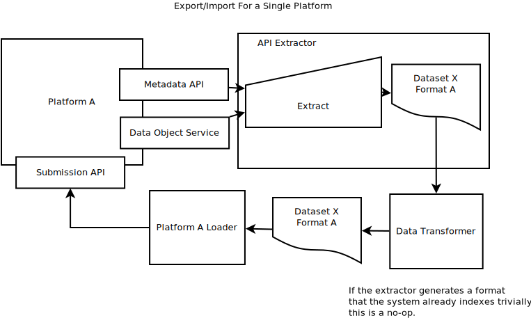

# Metadata Serialization

This document offers ways for platforms that are part of the NIH Data Commons Pilot to demonstrate 
Key Capability 7 (KC7), which is needed to guarantee the findability and portability of data. This 
document was prepared for Team Calcium. Examples and links from existing platforms will be added 
as they become available.

If you know of useful Metadata Serialization techniques please make a Pull Request!

1. [Metadata Portability](#portability)
2. [Concepts](#concepts)
3. [Use Cases](#usecases)
4. [Core Metadata](#coremetadata)
5. [Ontology Services](#services)
6. [schema.org](#schema)
7. [Case Studies](#casestudies)

<a name="portability" />

## Metadata Portability

This document is meant to provide strategies for Data Platforms, which have internal data 
management needs, to provide a path for clear interoperability in a Commons infrastructure.

A Data Commons provides a way for many services and Data Providers a way to interchange data, 
metadata, and the results of analyses. Without clear metadata, the data it points to will 
be difficult to index and make available for querying using clear semantics.

The Use Cases in this document are structured to address problems of serializing metadata that 
will minimize the impact on Data Platforms, while providing a clear ramp to making best use 
of available standards.

<a name="concepts" />

## Concepts

### Data 

For the purposes of this document it is important to separate the concepts of
data from metadata. Data are the first order items one would like to share, 
for example, a VCF might be data, while the file checksum would be metadata.

### Metadata

Metadata describe data and are usually string keys paired with string, numeric, 
array, or object-like values. Metadata should be representable in JSON schemas.

### Data Object

A file, resource, or API that has been uniquely identified for a given 
service, and which provides a minimum of fields from the Data Object 
Service schema.

### Serialization

Data as it is stored on disk or transmitted on a wire is sent as a serial 
ordered list of bits and can be a file or wire format. When a serialized 
message has been retrieved it is deserialized into memory.

### JSON

JavaScript Object Notation is a scheme for transmitting data between web 
services. Both metadata and interface methods for services in this document
communicate using JSON.

### JSON-LD

Extensions to JSON that allows it to represent links between Objects using
the addition of @context and @id protected keys.

### Ontology

A controlled vocabulary that allows hierarchical relationships between items
to be represented in a machine readable way.

### API

Application Programming Interface allow applications to be extended to other 
purposes and for programs to more easily communicate with each other.

### Extract

The process of accessing the relevant APIs needed to select some metadata for 
export. This can be carried out by one or more programs and often requires 
performing authenticated requests against a platform. The first stage of the
Extract, Transform, Load process.

### Transform

Data extracted from a platform is altered into a format suitable 
for loading into another platform. Explicit assumptions about the data model 
of the target format are made clear in transformer programs. The second 
stage of the Extract, Transform, Load process.

### Load

Once data have been tranformed into a format that is suitable for indexing 
into a platform, loader programs call the required submission APIs. The last 
stage of the Extract, Tranform, Load process.

<a name="usecases" />

## Use Cases

### Export Metadata to a Serialization Format

When arriving at a Data Platform, a client should be able to export data in some 
serialized format. That format may make implicit assumptions about the data model 
it is based on. 

The resulting export format should be useful for reasoning about the content of 
data provided by the platform. For example, exporting a TSV manifest of files 
from a file browser can be used by a downloader to create a local copy of a 
dataset.

### Import Metadata from a Serialization Format

Data Platforms should be able to import datasets given some serialized format. 
That format may make implicit assumptions about the Data Platform's data model.
It uses clearly defined interfaces in a Submissions API to import metadata from 
a described metadata serialization format.

### Export and Import Using the Same Format

By combining import and export use cases, a Platform is able to load data that 
has been exported from it. The serialized format may make implicit assumptions 
about the data model that will be imported. In this case, the transformation 
process may make minimal modifications to the metadata.

### Export Metadata from Platform A and Import to B

To support automated metadata interchange, a Data Platform should be able to 
export metadata, which eventually can be imported into a different Data Platform.

A client can coordinate this interaction by first requesting metadata from Data
Platform A. Using its Metadata API, it generates a serialized version of the 
dataset. The dataset, which may make implicit assumptions about the data model of
Platform A, is then provided to a Transformer. 

The Transformer program uses 
as much available data about the metadata model of A to translate metadata to be
imported into in Platform B. The resulting transformed dataset can then be 
imported using Platform B's Submissions API.

### Transformer Detail

The transformer program makes clear the cost of curating metadata from one 
serialization format to another. The goal is to provide a clear programmable 
interface for transforming metadata.

When using concrete versioned mappings between the metadata schemas provided 
by two platforms, it makes explicit the technical and human cost of data curation. 
If standards-based libraries are available, these software versions should 
also be explicitly defined.

<a name="coremetadata" />

## Core Metadata Use Cases

### Deduplication

### Ownership

### Provenance

### Data Use

<a name="schema" />

## schema.org

[schema.org](https://schema.org) hosts document types that can be used to provide 
structured metadata. Annotating documents using schema.org types can make it easier 
for the to be indexed later.

### JSON-LD Context Example

<a name="services" />

## Annotation Resources

Metadata annotation and linking are crucial to providing metadata serialization formats 
that can be easily interchanged and later indexed and queried.

A number of resources exist to make it easier to make well annotated metadata. If you would 
like to see your service here, open a PR!

### Zooma

> Zooma is a tool for mapping free text annotations to ontology term based on a curated repository of annotation knowledge.
> Where mappings are not found in the curated respository one or more ontologies can be selected from the Ontology Lookup Service to increase coverage. For example if you want to map GWAS annotations select the GWAS datasource and a common disease ontology such as EFO or DOID to maximise coverage when terms have no curated mappings. 

### biocontext

> ... a modular set of JSON-LD contexts for mapping abbreviated names of biological objects onto URIs for use in semantic web tool chains. Here, "abbreviated name" usually means a CURIE but optionally human-friendly symbolic names (e.g. gene) can also be used as abbrevations for complete URIs...

<a name="casestudies" />

## Case Studies

Add sheepdog-exporter, newt, loader example.

